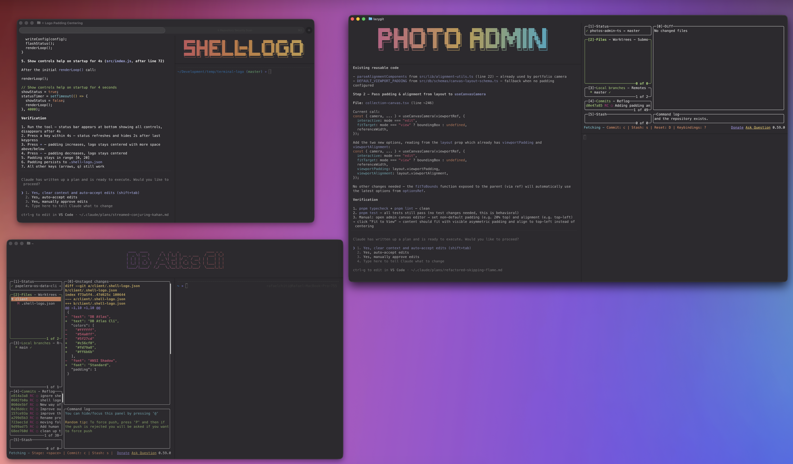

# shell-logo

Now that we are all coding with 1232 terminals open, is kind of hard to quickly find the one you want at a glance.
Adding a small configurable logo to quickly spot each project.



## Install

```bash
npm i -g shell-logo
# or
pnpm add -g shell-logo
```

## Usage

```bash
shell-logo
```

Launches an interactive menu where you can:

1. **Generate** - create a new `.shell-logo.json` config by picking text, colors, and a font
2. **Run** - display the logo from an existing `.shell-logo.json` in the current directory

Once the logo is displayed, use arrow keys to cycle through themes and `q` to quit.

## Config

The generated `.shell-logo.json` looks like this:

```json
{
  "text": "My Project",
  "font": "Standard",
  "colors": ["#ff6b6b", "#feca57"],
  "padding": 1
}
```

| Field     | Type       | Default                             | Description                       |
| --------- | ---------- | ----------------------------------- | --------------------------------- |
| `text`    | `string`   | _(required)_                        | The text to render as ASCII art   |
| `font`    | `string`   | `"Standard"`                        | Figlet font name                  |
| `colors`  | `string[]` | `["#ff6b6b", "#feca57", "#48dbfb"]` | Hex colors for the gradient (>=2) |
| `padding` | `number`   | `1`                                 | Vertical padding above the logo   |

See `examples/` for more config samples.

## Publishing to npm

```bash
# 1. Make sure you're logged in
npm login

# 2. Do a dry run to verify what gets packed
npm pack --dry-run

# 3. Publish
npm publish

# For subsequent releases, bump the version first
npm version patch  # or minor / major
npm publish
```

## License

MIT
